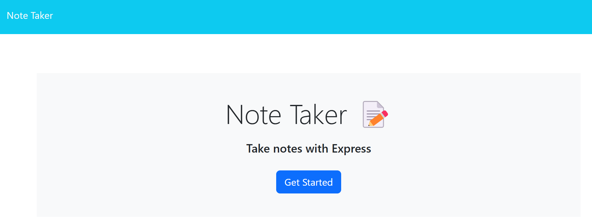
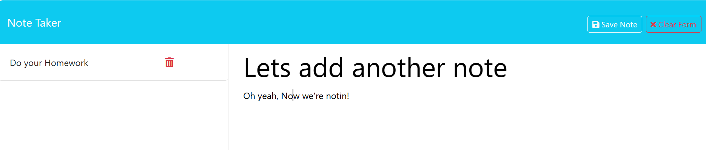

# Note Taker
[Link to the live Note-Taker App](https://note-taker-4yle.onrender.com)

## Table of Contents
- [Note Taker](#note-taker)
  - [Table of Contents](#table-of-contents)
  - [Description](#description)
  - [Installation](#installation)
  - [Usage](#usage)
  - [Contributing](#contributing)
  - [Questions](#questions)
## Description
This is a Note Taker App, created using an Express.js back end.  The notes are stored in a JSON file.
## Installation
`npm install`
## Usage
Enter a Title and Text for your note, then click the Save button to add the note to the list.

## Contributing
Please follow the [Contributor Covenant](https://www.contributor-covenant.org/) guidelines.
## Questions
If you have any questions, please reach out to me at swokamoto@gmail.com. 
You can also check out the project at [https://github.com/swokamoto/note-taker](https://github.com/swokamoto/note-taker).
